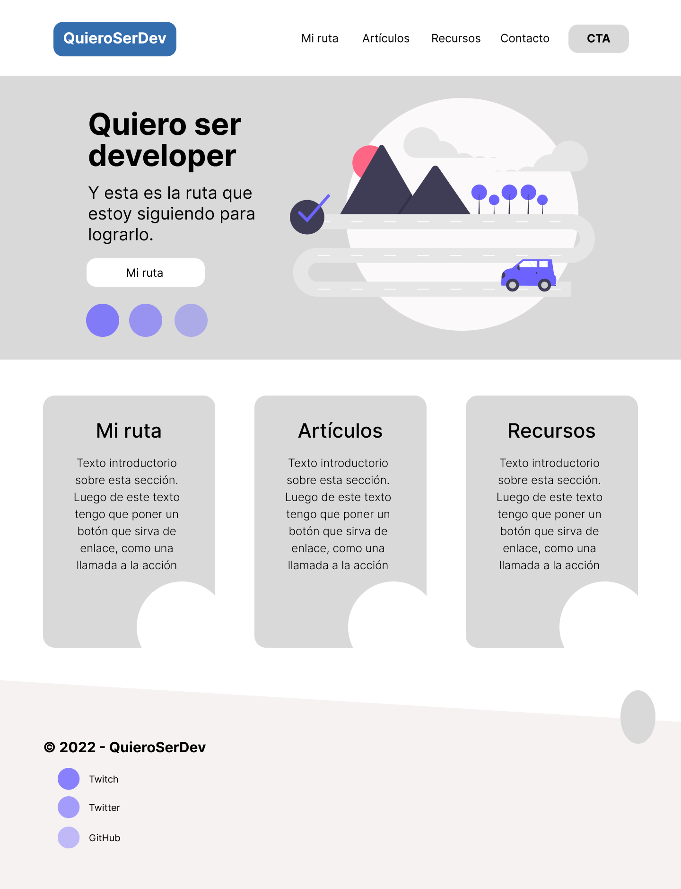
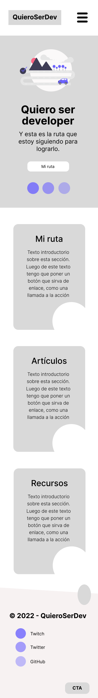
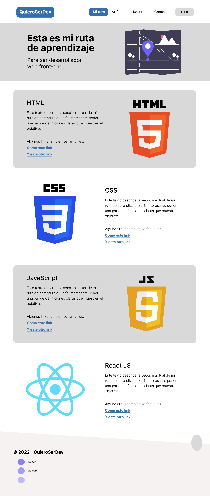
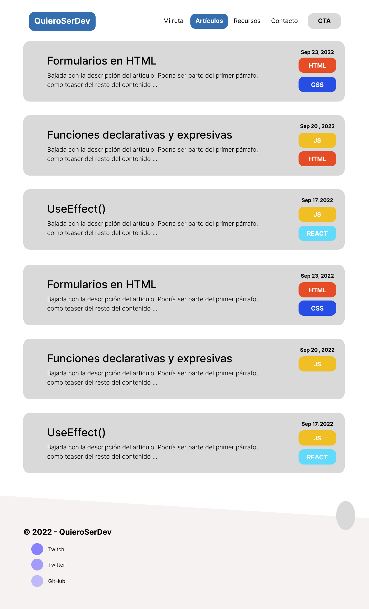
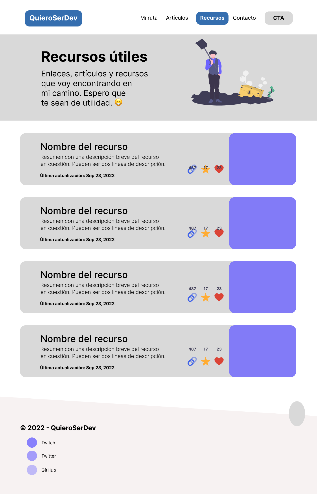
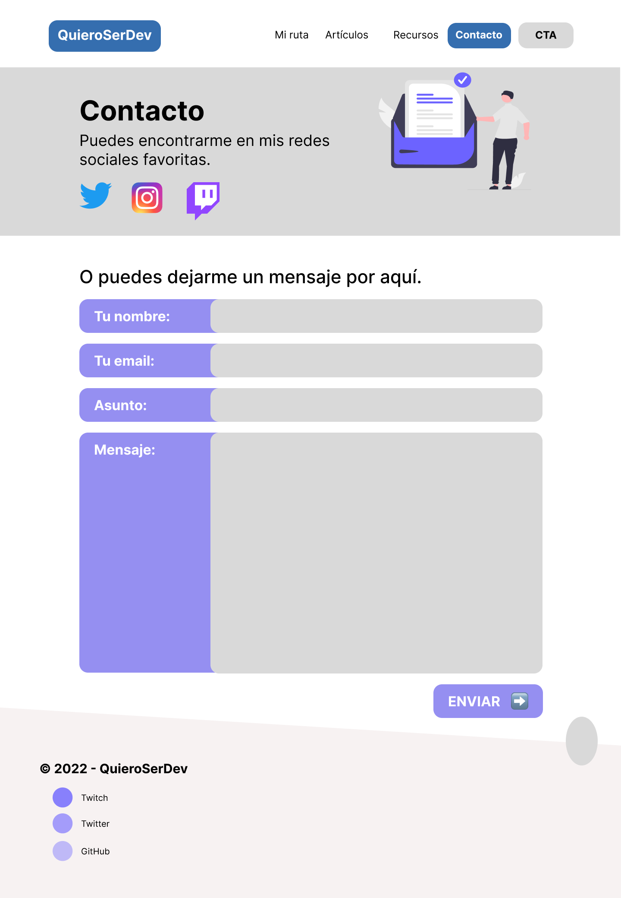

# Trabajos del curso de diseño web de CoderHouse — Comisión #33085

[<-- Volver a README.md](../README.md)

- Alumno: **Matias Baldanza**
- Curso: **Diseño Web**
- Comisión: **#33085**
- [Enlace al repositorio](https://github.com/matiasbaldanza/coderhouse-diseno-web-33085)
- [Enlace a esta sección en el repositorio](https://github.com/matiasbaldanza/coderhouse-diseno-web-33085/tree/main/QuieroSerDev-V1.1)

## Corrección Pre-entrega 1: 2022-10-08

Hice estas correciones en vivo en Twitch el sábado 8 de octubre de 2022.

Si les da curiosidad, aquí está el enlace al video grabado:

- [Única sesión](https://www.twitch.tv/videos/1618512853) - Extender el prototipo en Figma, cambios en el código HTML y CSS y subida al repositorio.

### Código

[QuieroSerDev versión 1](https://github.com/matiasbaldanza/coderhouse-diseno-web-33085/tree/main/QuieroSerDev-V1.1)

Notas:

- Moví las páginas secundarias a una subcarpeta dentro del sitio.
- Como se indicó, las páginas secundarias no tienen el link **h2** porque no tienen contenido (son únicamente un _placeholder_). Igualmente, aunque no implementé todas las páginas en HTML y CSS, hice algunos cambios como placeholder.

- Agregué los wireframes de la versión desktop para las 4 sub-secciones del sitio (Mi Ruta, Artículos, Recursos, Contacto).
  [Proyecto actualizado en Figma](<https://www.figma.com/file/c8qiSmkI9GXQLvBMIAX35P/QuieroSerDev-v1.1-re-entrega-(wireframe)?node-id=102%3A990>)

### Sitio en vivo

[QuieroSerDev versión 1.1](https://matiasbaldanza.github.io/coderhouse-diseno-web-33085/QuieroSerDev-V1.1/export/index.html)

### Mapa del sitio

[Mapa del sitio en formato MD](docs/sitemap.md)

### Prototipo

[Proyecto actualizado en Figma](<https://www.figma.com/file/c8qiSmkI9GXQLvBMIAX35P/QuieroSerDev-v1.1-re-entrega-(wireframe)?node-id=102%3A990>)

#### Homepage: Versión desktop y mobile

|                                                                               Diseño para versión desktop                                                                                |                                Diseño para versión mobile                                |
| :--------------------------------------------------------------------------------------------------------------------------------------------------------------------------------------: | :--------------------------------------------------------------------------------------: |
|                      |  |

#### Sub-página: MI RUTA (solo versión desktop)

#### Sub-página: ARTÍCULOS (solo versión desktop)

#### Sub-página: RECURSOS (solo versión desktop)

#### Sub-página: CONTACTO (solo versión desktop)

