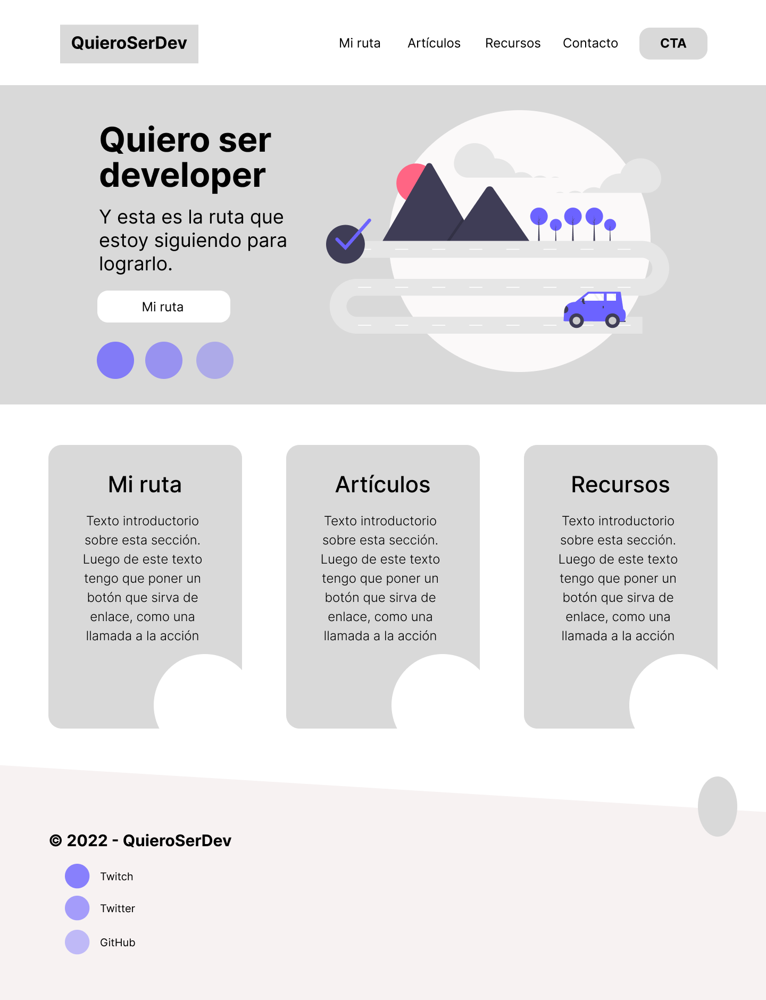
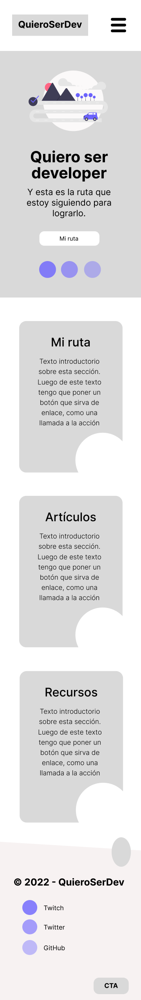

# Trabajos del curso de diseño web de CoderHouse — Comisión #33085

[<-- Volver a README.md](../README.md)

- Alumno: **Matias Baldanza**
- Curso: **Diseño Web**
- Comisión: **#33085**

## Pre-entrega 1: 2022-09-30

Desarrollé este sitio en vivo en Twitch entre el jueves 29 y viernes 30 de setiembre.

Si les da curiosidad, aquí están los enlaces a los videos grabados:

- [Primera sesión](https://www.twitch.tv/videos/1604455760) - 29 de setiembre (mapa del sitio, primera parte del prototipo en Figma)
- [Segunda sesión](https://www.twitch.tv/videos/1605338583) - 30 de setiembre (finalizar prototipo en Figma, implementar header y estilos base)
- [Tercera sesión](https://www.twitch.tv/videos/1605662148) - 30 de setiembre (finalizar implementación y hacer la entrega)

### Sitio en vivo

[QuieroSerDev versión 1](export/index.html)

### Mapa del sitio

[Mapa del sitio en formato MD](docs/sitemap.md)

### Prototipo

[Proyecto en Figma](<https://www.figma.com/file/x3iLIj3uOTBvPVzFslg58k/QuieroSerDev-v0-(wireframe)?node-id=0%3A1>)

Imágenes del diseño:

|                                                                   Diseño para versión desktop                                                                   |                           Diseño para versión mobile                           |
| :-------------------------------------------------------------------------------------------------------------------------------------------------------------: | :----------------------------------------------------------------------------: |
|                      |  |
